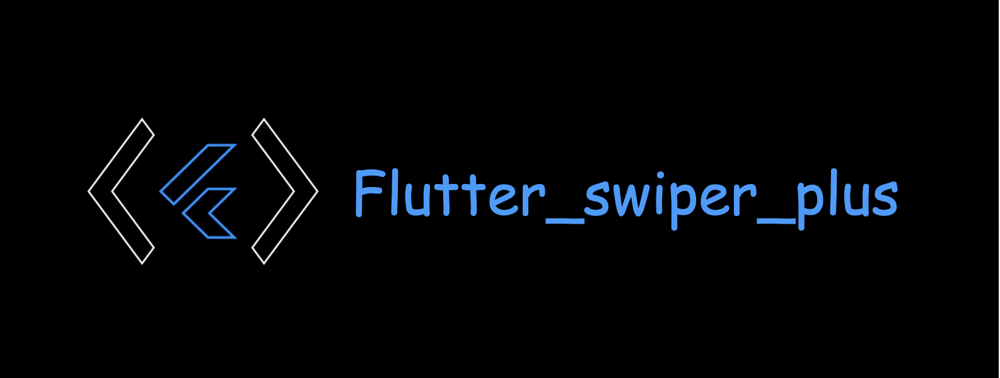

<p align="center">
    <a href="https://github.com/mimajiushi/flutter_swiper_plus">
        <b>English</b>
    </a>
</p>

# flutter_swiper_plus

继承自[flutter_swiper](https://github.com/best-flutter/flutter_swiper)组件 + 适配Flutter空安全, 多种布局方式，无限轮播，Android和IOS双端适配.
> 如需空安全之前的版本（Flutter 2.0之前），请使用：[flutter_swiper](https://github.com/best-flutter/flutter_swiper)

---

# :sparkles: New Features: 分页组件

正在使用这个项目作为分页： [flutter_page_indicator](https://github.com/best-flutter/flutter_page_indicator)  .
> 该组件的代码已经被直接放到`flutter_swiper_plus`

# :sparkles: New Features: 视差

我们在 Swiper 中也像android一样支持了 `PageTransformer`, 只要给Swiper设置一下 `transformer` 属性就行,
这里返回一个被转换的组件给Swiper. 目前仅仅支持 `DEFAULT`布局.
感谢 @FlutterRocks ,棒棒哒 👏.

正在使用这个项目作为视差 [transformer_page_view](https://github.com/best-flutter/transformer_page_view)  .
> 该组件的代码已经被直接放到`flutter_swiper_plus`

---

# 例子截图

## 横向  


## 纵向  

  
## 横纵各一半  

  
## 类似B站配文字的  
  - 自己配的👇：  
  - 
  - B站原版👇：  
  - 

## 模仿手机页面  
  

  
---

# 不同的过度动画

- 可以自己覆写`PageTransformer`来自定义动画，参考[`buildin_transformers.dart`](https://github.com/mimajiushi/flutter_swiper_plus/blob/master/lib/src/transformer_page_view/buildin_transformers.dart)
- 目前已有的动画如下所示👇：  
  
  
> 你可以运行代码中的example中的 [`main.dart`](https://github.com/mimajiushi/flutter_swiper_plus/blob/master/example/lib/main.dart) 查看实际效果

---

# 内建布局

- 这部分目前是通过枚举控制的，可在example项目的`Custom All`中预览
- 以下是示范👇：  
  

> 同样的，你可以运行代码中的example中的 [`main.dart`](https://github.com/mimajiushi/flutter_swiper_plus/blob/master/example/lib/main.dart) 查看实际效果

- 构建你自己的动画十分简单，比如像下面这样👇:
```

 new Swiper(
  layout: SwiperLayout.CUSTOM,
  customLayoutOption: new CustomLayoutOption(
      startIndex: -1,
      stateCount: 3
  ).addRotate([
    -45.0/180,
    0.0,
    45.0/180
  ]).addTranslate([
    new Offset(-370.0, -40.0),
    new Offset(0.0, 0.0),
    new Offset(370.0, -40.0)
  ]),
  itemWidth: 300.0,
  itemHeight: 200.0,
  itemBuilder: (context, index) {
    return new Container(
      color: Colors.grey,
      child: new Center(
        child: new Text("$index"),
      ),
    );
  },
  itemCount: 10)

```

- `CustomLayoutOption` 被设计用来描述布局和动画,很简单的可以指定每一个元素的状态，不如下面这样👇：

```
new CustomLayoutOption(
      startIndex: -1,  /// 开始下标
      stateCount: 3    /// 下面的数组长度 
  ).addRotate([        //  每个元素的角度
    -45.0/180,
    0.0,
    45.0/180
  ]).addTranslate([           /// 每个元素的偏移
    new Offset(-370.0, -40.0),
    new Offset(0.0, 0.0),
    new Offset(370.0, -40.0)
  ])

```

---

# 更新记录

- 参考：[CHANGELOG-ZH.md](https://github.com/mimajiushi/flutter_swiper_plus/blob/master/CHANGELOG-ZH.md)

---

# 快速开始

- [安装插件](#安装插件)
- [极简例子](#极简例子)
- [构造函数](#构造函数)
    + [基本参数](#基本参数)
    + [分页指示器](#分页指示器)
    + [控制按钮](#控制按钮)
    + [控制器](#控制器)
    + [自动播放](#自动播放)

## 安装插件

在`pubspec.yaml`中添加如下依赖👇：

```yaml
dependencies:
  flutter_swiper_plus : 2.0.4
```

然后项目根目录执行如下命令👇：

```bash
flutter packages get 
```

---

## 极简例子

```dart
import 'package:flutter/material.dart';
import 'package:flutter_swiper_plus/flutter_swiper_plus.dart';

void main() => runApp(new MyApp());

class MyApp extends StatelessWidget {
  @override
  Widget build(BuildContext context) {
    return new MaterialApp(
      title: 'Flutter Demo',
      theme: new ThemeData(
        primarySwatch: Colors.blue,
      ),
      home: new MyHomePage(title: 'Flutter Demo Home Page'),
    );
  }
}

class MyHomePage extends StatefulWidget {
  MyHomePage({Key? key, required this.title}) : super(key: key);

  final String title;

  @override
  _MyHomePageState createState() => new _MyHomePageState();
}

class _MyHomePageState extends State<MyHomePage> {

  @override
  Widget build(BuildContext context) {
    return new Scaffold(
      appBar: new AppBar(
        title: new Text(widget.title),
      ),
      body:  new Swiper(
        itemBuilder: (BuildContext context,int index){
          return new Image.network("http://via.placeholder.com/350x150",fit: BoxFit.fill,);
        },
        itemCount: 3,
        pagination: new SwiperPagination(),
        control: new SwiperControl(),
      ),
    );
  }
}
```

---

## 构造函数

### 基本参数

| 参数            | 默认值             |           描述     |
| :-------------- |:-----------------:| :------------------------|
| scrollDirection | Axis.horizontal  |滚动方向，设置为Axis.vertical如果需要垂直滚动   |
| loop            | true             |无限轮播模式开关                              |
| index           | 0                |初始的时候下标位置                            |
| autoplay        | false             |自动播放开关. |
| onIndexChanged  | void onIndexChanged(int index)  | 当用户手动拖拽或者自动播放引起下标改变的时候调用 |
| onTap           | void onTap(int index)  | 当用户点击某个轮播的时候调用 |
| duration        | 300.0            | 动画时间，单位是毫秒 |
| pagination      | null             | 设置 `new SwiperPagination()` 展示默认分页指示器
| control | null | 设置 `new SwiperControl()` 展示默认分页按钮

---

### 分页指示器

分页指示器继承自 `SwiperPlugin`,`SwiperPlugin` 为 `Swiper` 提供额外的界面.设置为`new SwiperPagination()` 展示默认分页.


| 参数            | 默认值             |           描述     |
| :------------ |:---------------:| :-----|
| alignment | Alignment.bottomCenter  | 如果要将分页指示器放到其他位置，那么可以修改这个参数 |
| margin | const EdgeInsets.all(10.0) | 分页指示器与容器边框的距离 |
| builder | SwiperPagination.dots | 目前已经定义了两个默认的分页指示器样式： `SwiperPagination.dots` 、 `SwiperPagination.fraction`，都可以做进一步的自定义. |

如果需要定制自己的分页指示器，那么可以这样写：

```
new Swiper(
    ...,
    pagination:new SwiperCustomPagination(
        builder:(BuildContext context, SwiperPluginConfig config){
            return new YourOwnPaginatipon();
        }
    )
);

```

---

### 控制按钮

控制按钮组件也是继承自 `SwiperPlugin`,设置 `new SwiperControl()` 展示默认控制按钮.


| 参数            | 默认值             |           描述     |
| :------------ |:---------------:| :-----|
| iconPrevious | Icons.arrow_back_ios  | 上一页的IconData |
| iconNext | Icons.arrow_forward_ios | 下一页的IconData |
| color | Theme.of(context).primaryColor | 控制按钮颜色 |
| size | 30.0                           | 控制按钮的大小 |
| padding | const EdgeInsets.all(5.0) | 控制按钮与容器的距离 |

---

### 控制器

`SwiperController` 用于控制 Swiper的`index`属性, 停止和开始自动播放. 通过 `new SwiperController()` 创建一个SwiperController实例，并保存，以便将来能使用。  

| 方法            | 描述     |
| :------------ |:-----|
| void move(int index, {bool animation: true}) | 移动到指定下标，设置是否播放动画|
| void next({bool animation: true}) | 下一页 |
| void previous({bool animation: true}) | 上一页 |
| void startAutoplay() | 开始自动播放 |
| void stopAutoplay() | 停止自动播放 |

---

### 自动播放

| 参数            | 默认值             |           描述     |
| :------------ |:---------------:| :-----|
| autoplayDely | 3000  | 自动播放延迟毫秒数. |
| autoplayDisableOnInteraction | true | 当用户拖拽的时候，是否停止自动播放. |

---

